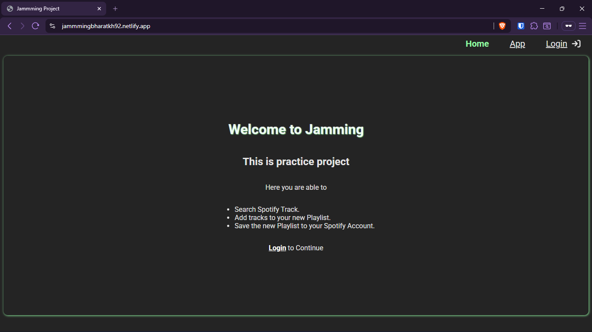
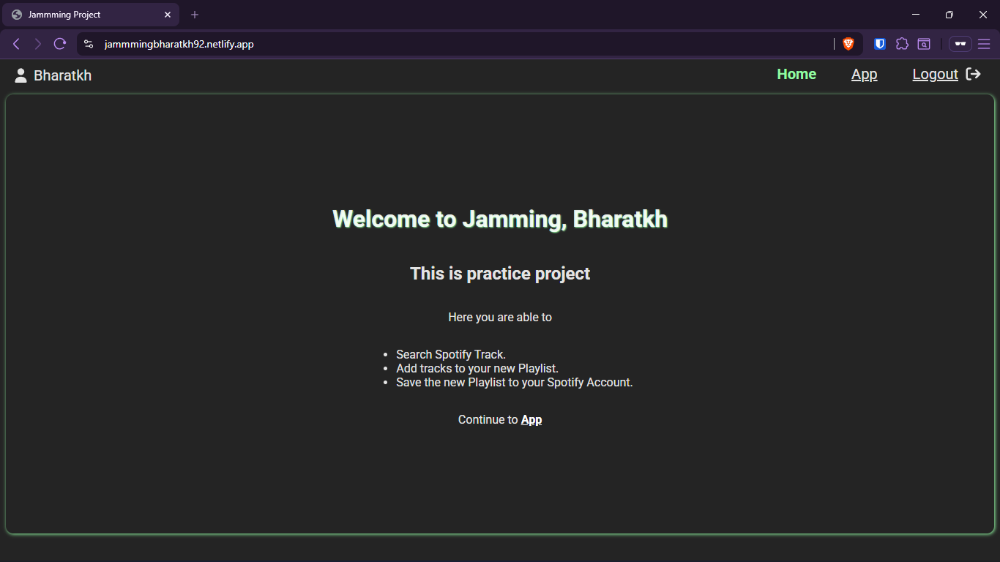
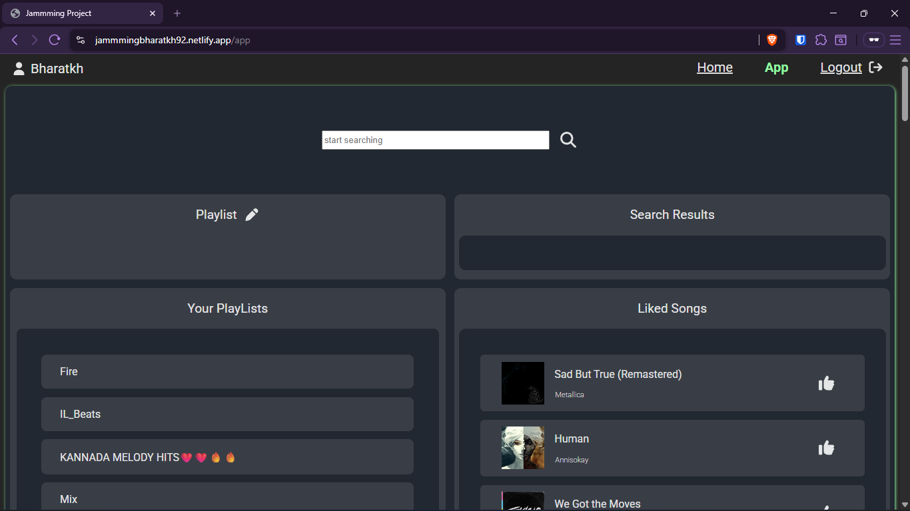
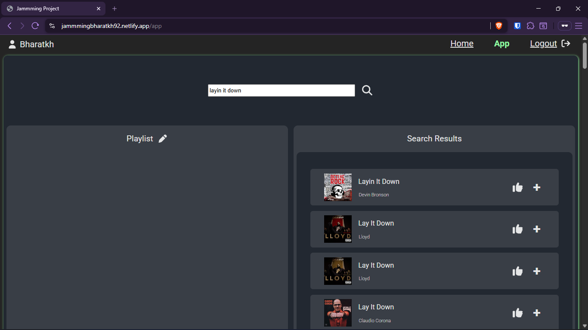
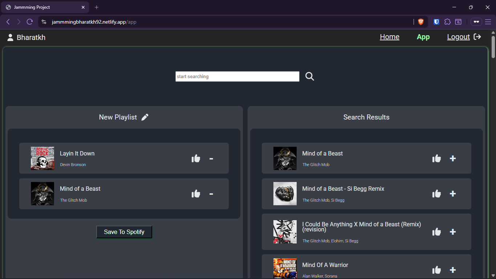
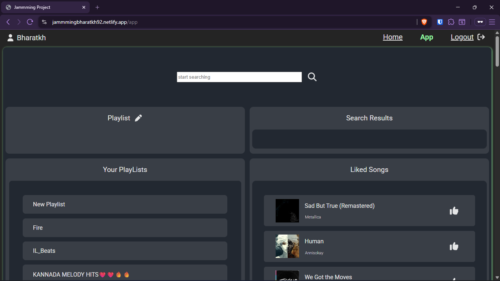

## Jammming is a paractice Project
- Tech Stack: React.js, HTML, CSS, Spotify Web API, and Vite
- Implemented the Spotify PKCE authorization flow to authenticate users and manage user access tokens.
- Handled multiple asynchronous API requests to the Spotify API to retrieve and display user data, including their saved playlists, liked songs, and username.
- Developed search functionality that enables users to query tracks, select songs, and add them into newly created, custom playlists.
  
### Requirements
- **Spotify Premium Plan** - to use the API.
- **Spotify Client Id** - to request API from the App.
- **User Email** - user email added to developper dashborad.
  
### To run the app

- The live app is hosted [here](https://jammmingbharatkh92.netlify.app/).
- We need to create an Client ID at [Spotify Developpers website](https://developer.spotify.com/dashboard)
- To use the app we need to add the client id and redirect URI inside the ```authCodeWithPkce.js```;
  ````javascript
  const clientId = "66658c358a2d4036983a5e036dad9f41";
  const redirectUri = "https://jammmingbharatkh92.netlify.app/callback";
  ````
- Add the user who's using the app inside user management inside developper dashboard.
  
### Screenshots

#### Homepage





#### App



#### Search and new Playlist





#### Updated Playlist and Liked songs

